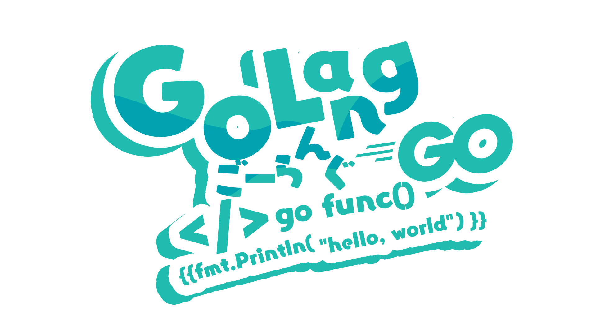
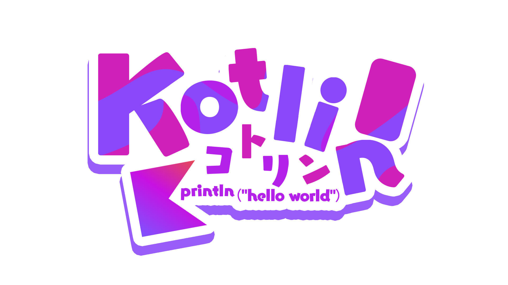
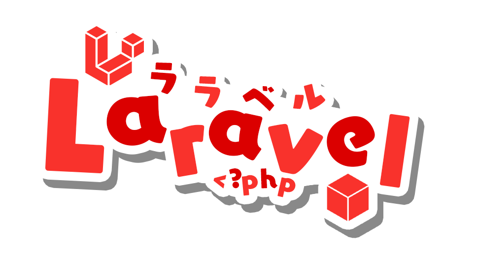
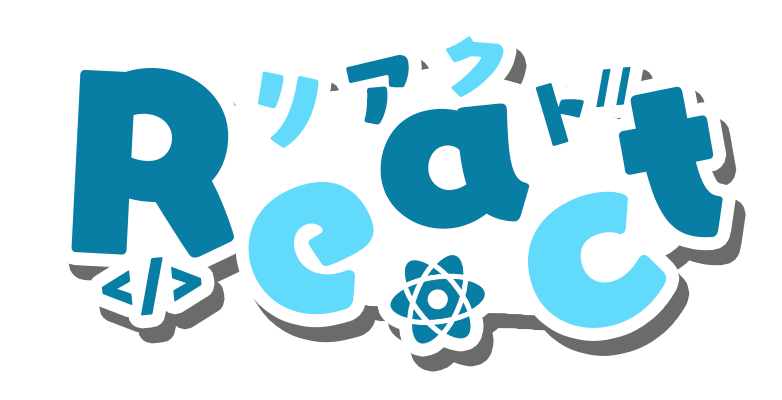
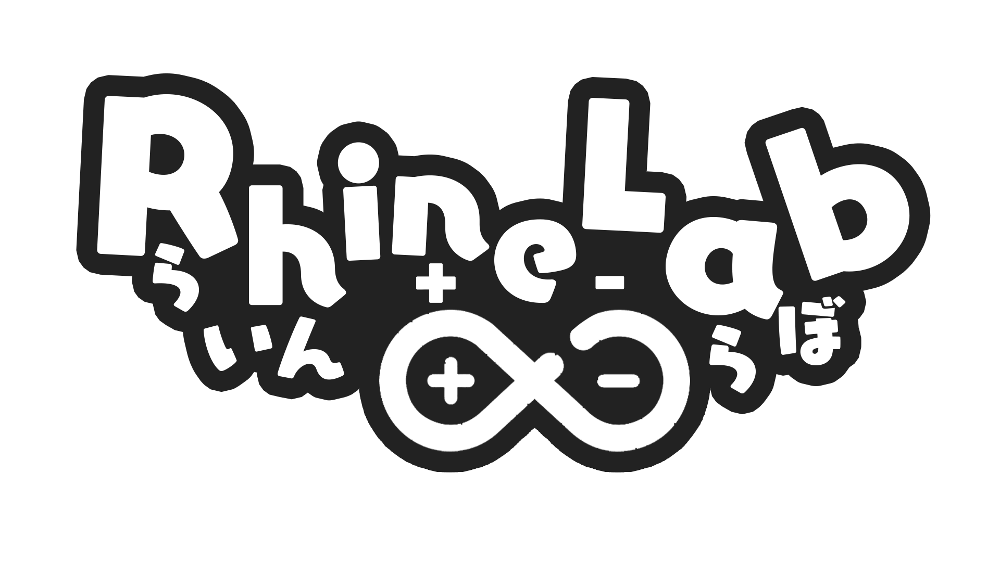
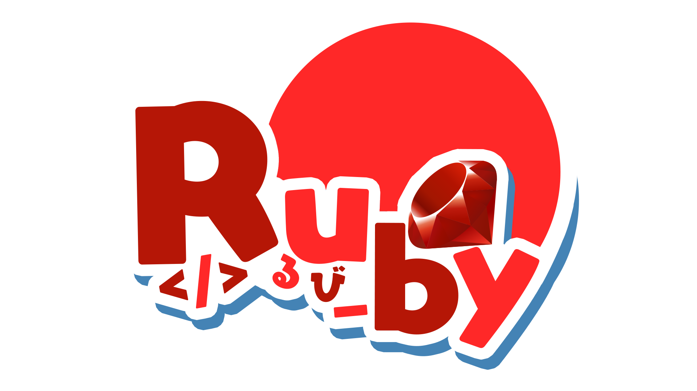
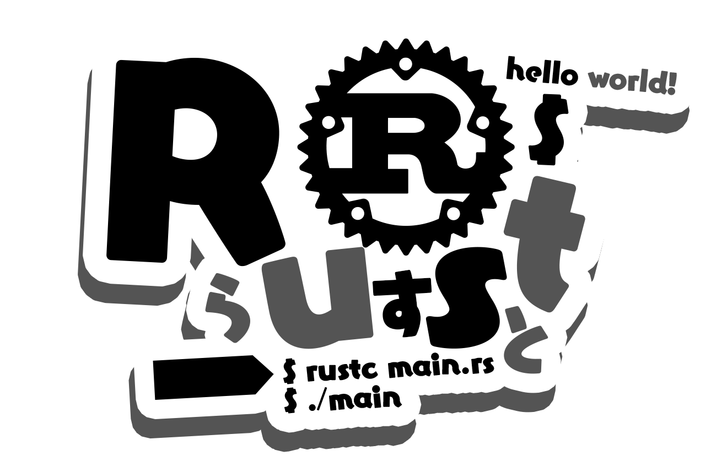

<kbd>[English README](README.md)</kbd>
<kbd>[日本語 README](README-ja.md)</kbd>
<kbd>[简体中文 README](README-zhHans.md)</kbd>
<kbd>[繁體中文 README](README-zhHant.md)</kbd>

# ServiceLogos
Hello, good morning, good evening.
This is a repository created by Sawaratsuki to upload logos of various services.

> [!WARNING]
> The logos here are not official logos.

# License
## If you want to use the logo, please read this section carefully.
> [!NOTE]
> ### Summary:
> - You are free to use this logo for non-commercial, non-profit purposes.
>   For example, you can use it for printing as stickers, as icons for editors, etc.
> - Please give the appropriate credits!
>   You are free to modify or remix it, but you must license that new work under the same license as this original logo.
> - If you create something using this logo, mentioning [Sawaratsuki](https://x.com/sawaratsuki1004) when posting would be motivating!

### All items

1. The creator of these logos is Sawaratsuki. The copyright has not been completely waived.
2. These logos are provided under [Creative Commons Attribution-NonCommercial-ShareAlike 4.0 International (CC BY-NC-SA 4.0)](https://creativecommons.org/licenses/by-nc-sa/4.0/deed.en).
>  - It is recommended to give appropriate credit. It is a great motivator, so please do so.
>  - You can modify or remix it, but you must give the new work the same license (CC BY-NC-SA 4.0) as the original work.
>  - Commercial use (such as selling products using the logo) is prohibited. However, it can be sold if it falls under the following conditions:
>    1. If the official of each service wants to sell for profit
>    2. If permission is granted by Sawaratsuki  
>       (If you find any violations, please contact [@Sawaratsuki](https://x.com/sawaratsuki1004) immediately!)
3. It's okay to use stickers, seals, etc., for personal use without permission!

# Want a logo that's not here!
Please post it in the issues. We'll create it once confirmed.
Depending on individual schedules, we may not be able to respond immediately. It may take several days.
> [!IMPORTANT]  
When posting to issues, be sure to include a request tag.

# For officials of each service

Please send a [Direct message to SAWATSUKI](https://x.com/sawaratsuki1004) to request a logo removal.
We will remove it immediately.
If you would like to sell your product officially, please send a [Direct message to SAWATSUKI](https://x.com/sawaratsuki1004) in the same way!

# Tools used for designing
- Photoshop / Illustrator
- Font [Eureka Font]
- Sawaratsuki's motivation and feelings
- Feedback posts from everyone

## image :

| Name | Image |
|-------------------------------|--------|
| 404Notfound  |  |
| Angular      |   |
| ArchLinux    |  |
| C#           |   |
| C++          |  |
| C,C#,C++     |  |
| C            |  |
| Clion        |  |
| Cloudflare   |  |
| Cobol        |  |
| Crowdstrike  |  |
| FORTRAN      |  |
| Figma        |  |
| FlipperZero  |  |
| Flutter      |  |
| GitHub       |  |
| GitLab       |  |
| Gnuemacs     |  |
| Go           |  |
| Haskell      |   |
| Hono         |  |
| Html         |  |
| Htmx         |  |
| IamSeries    |     |
| Java         |  |
| Juniper      |  |
| Kotlin       |   |
| Laravel      |  |
| Mui          |  |
| Next.js      |  |
| Node.js      |  |
| Photoshop    |  |
| Python       |  |
| Qwik.js      |  |
| RaspberryPi  |  |
| React        |  |
| RhineLab     |  |
| Rider        |  |
| Rstudio      |  |
| Ruby         |  |
| Rust         |  |
| Streamloots  |  |
| Swift        |  |
| Tailwindcss  |  |
| Teamspeak    |  |
| Twitter      |  |
| TypeScript   |  |
| Ubuntu       |  |
| UnityBlender |  |
| Vim          |  |
| Vite         |  |
| Voicemod     |  |
| Vrchat       |  |
| Vue          |  |
| Wallhack     |  |
| X            |  |
